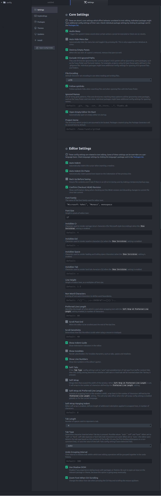
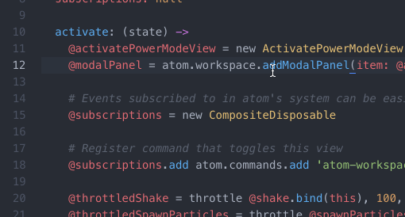
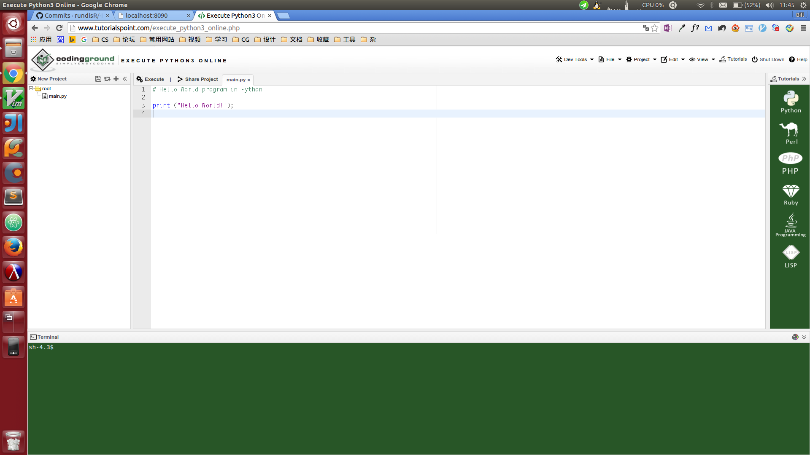

# 写给身边同学们的Python Guide

## 目录：

[0. 为什么写这篇文 ............................. Why I write this passage](#0)<br>
[1. 谁应该看这篇文 ............................. Who should read this passage](#1)<br>
[2. 准备工作 ........................................ Preparation](#2)<br>
........ [2.1 适合的解释器 ...................... A suitable interpreter](#2.1)<br>
........ [2.2 CPython的安装方式 ............ Installation of CPython](#2.2)<br>
........ [2.3 适合的编辑器 ...................... A suitable editor](#2.3)<br>
........ [2.4 Atom安装+设置 ................... Atom's installation & settings](#2.4)<br>
........ [2.5 在线IDE ............................... Online IDE](#2.5)<br>
[3. 什么是Python ................................. Literal meaning of Python](#3)<br>
[4. 重新理解Hello world ........................Re-understand Hello world](#4)<br>
[5. Python的编程范式 .......................... Programming convention of Python](#5)<br>
[6. for语句 ............................................ For statement](#6)<br>
[7. 数据结构 ......................................... Data structure](#7)<br>
[8. 模块化 ............................................. Moduling programming](#8)<br>
[9. 函数 ................................................. Function](#9)<br>

## 公告
1. 这篇文章如果有Typo可以微信我或者贴issue
2. 如果有任何还是不懂的地方 | 有更深入的问题可以微信我
3. 如果有任何建议（添加内容之类的），请联系我然后等我哪天心情好再说（逃

## 版本历史
详见[此处](update_log.md)

<h2 id="0">为什么写这篇文</h2>
新学期G2的CS老师换成老D之后开始赶syllabus剩下的大量内容，大部分人都遇到了不少的问题，最大
的应该是：原来靠死记硬背的方式考试已经行不通了。

鉴于湘哥本身也不会多少编程（人家是商科+cs联合学科的= =），本身大部分同学的编程能力就薄弱
，而老D讲东西又不清楚，所以才有写这篇文的打算。本来是打算在project的due之前写的，因为各种
原因拖到现在（逃

老D布置了Project之后，看到很多人在网上看教程补Python。不过网上的教程很多不一定适合，其中
我认为最好的，也就是[廖雪峰的教程](http://www.liaoxuefeng.com/wiki/0014316089557264a6b348958f449949df42a6d3a2e542c000)
我也很惊喜的发现有部分人找到了它。然而不得不说的是，即使是廖雪峰的教程，也有很多地方讲的
有不清楚，而且其中包含的一些部分很多同学现在最好不要看的东西（可能会陷进去，导致越学越乱
，或者是会因为理解不到位导致的很多问题），譬如 函数式编程 Functional Programming，这个是
不少程序员和国内大学生都没有理解的东西= =

另外也有朋友拿着其他我们同学写的教程问我说看不懂，我看了之后也发现里面有不少误导性的范式
和写法，这篇文也算是帮助大家理解吧

<h2 id="1">谁应该看这篇文</h2>
毫不谦虚的说，这个年级只有我不用看（捂脸逃
本文中会有涉及到与Java和C#的联系，学习过的同学应该会比较容易接受Python的概念。
另外我会稍微提及一丢丢CPython的底层实现帮助理解。
斜体部分不懂的请不要纠结请强跳。

<h2 id="2">准备工作</h2>
写Python前有两个准备工作总是给大部分人忽略，这里我要重新提起来：

0. interpreter
1. a suitable editor

<h3 id="2.1">适合的解释器</h3>
Python本身的确是一门语言，也就是仅仅一纸规范而已，说明语法规则和明明规范。而解释器，也就
正如我们上课教的一样，才是真正运行Python程序的东西。
这里有必要提一下编译器和解释器的区别，这一点龙书Compilers Principles, Techniques, & Tools
已经讲的很清楚了：

Compiler:
>a compiler is a program that can read a program in one language
>— the source language — and translate it into an equivalent program in
>another language — the target language

Interpreter:
>An interpreter is another common kind of language processor. Instead of
>producing a target program as a translation, an interpreter appears to directly
>execute the operations specified in the source program on inputs supplied by
>the user

总结一下就是，编译器是个程序，把你的源码转成另一种语言（譬如二进制的machine language），
而你需要手动运行/用解释器解释运行目标文件才能运行程序。

然而解释器就是个黑盒子，给他源码，然后他就会运行它，并不需要另外双击运行目标文件之类的，
你直接和interpreter做IO就可以。（注：IO = Input & Output）

（前方高能预警

*而Python的解释器，最为常用的，[CPython](https://www.python.org/downloads/)，也就是用C语
言实现的Python解释器，就是我们从官网下载的解释器版本。这个版本最为常用，当然对标准的支持
最为完善，库的数量最多。不过它也有许多不足，其中之一就是性能;首当其冲的GIL对多线程效率的
影响一直为人诟病，然而大量的CPython库已经严重依赖于它，短时间没有去除的可能性。CPython先
将Python源码编译为字节码（.pyc文件），然后再由虚拟机解释执行（不要纠结什么是虚拟机！！！
）。另外一个很大的CPython的缺点是垃圾回收方式，他只支持引用计数（reference counting），也
就意味着大家熟知（才不）的循环引用问题也是它的一大漏洞。*


*除了CPython之外，在CLR(.NET)上实现的IronPython和在JVM上实现的JPython也是著名的Python解释
器实现。对于要在程序中使用C#/Java的相关代码时，这两个都是很好的选择。*

*还有一个PyPy是利用RPython和Tracing JIT技术实现的Python，它可以选择多种垃圾回收方式，譬如
标记清除mark & sweep（javascript使用的方式），标记压缩，分代之类的。性能对于CPython提升非
常明显，然而对第三方模块的支持并不好。*

*还有一个我最近了解到的Pyston，由Dropbox开发的解释器，目测挺牛逼，然而我并不了解就不说了
（捂脸逃*

**然而不要想太多，老老实实用CPython吧（正经**

<h3 id="2.2">CPython安装方式</h3>
Windows:

进入[官网](https://www.python.org/downloads/)下载就是了

Debian/Ubuntu/Linux Mint:

`(sudo) apt-get install python`

Mac OS:

方法一：同Windows<br>
方法二：如果安装了Homebrew：

`brew install python3`

<h3 id="2.3">适合的编辑器</h3>
现在全年级有两种主流：

0. 用IDLE
1. 根据大部分教程所介绍的，用sublime text

**然而两种都不推荐**

为什么两种我都不推荐呢，因为：

0. IDLE真的很垃圾我就不解释了，马上你用了我推荐的你就知道了
1. sublime text就如它名字一样，非常好使，然而它的配置对于所有我们年级的人来说都是噩梦（逃
，但如果你不配置那就失去了用它的意义了（配置文件完全手写json）

**所以今天我要强行安利一个配置方法友好，使用的体验不亚于sublime text的编辑器** -- [Github Atom](https://atom.io)

<h3 id="2.4">Atom安装+设置</h3>

0. 进入上面的那个链接
1. 下载安装atom
2. 打开atom
3. 在上边的工具栏选择 Edit - Preference 进入设置页面，将设置调成如下的样子：<br>
<br>
4. 随便新建一个Python文件就可以开始编码了

p.s.: 这两天看到一个很有意思的atom插件[activate-power-mode](https://atom.io/packages/activate-power-mode)
具体它的效果是这样的：



配合青轴食用更佳（逃

0. Activate-power-mode的安装
打开atom进入 Edit - Preference，接着在左边的导航栏选择 Install 来安装插件。在搜索框中输入
activate-power-mode然后点击第一条搜索记录旁边的 `Install` 蓝色按钮来安装。

1. Activate-power-mode的启用
在atom顶端的菜单栏中找到 Package （倒数第二项），然后在 Package - activate-power-mode 中
点击 `Toggle` 就可以打开了。

<h3 id="2.5">在线IDE</h3>
有时候条件有限，或者在阅读本文的时候懒得重新开文件写代码运行再删掉，我在这里再介绍一种运
行代码的方式 -- 在线IDE。IDE, 全称是Intergrated Developing Environment，是集成了各种功能
的开发工具，而至于有多少功能要看具体的IDE。整个高中范围内没有使用IDE的必要，所以我这里的
在线IDE也并没有太多复杂的功能。使用编辑器是一种好的习惯，也是三流程序员之间优越感的来源之
一（捂脸逃

首先打开[Online IDE](http://www.tutorialspoint.com/execute_python3_online.php)，会进入这
个界面：

0. Online IDE介绍<br>
<br>
我们可以看到这个界面分为三部分：左边的文件目录树，右边的编辑器和下面的终端。它的编辑器没
有atom的好用，但是对于我们的学习来说已经绰绰有余了。下面的终端可以用来运行大部分我们提到
的命令，譬如运行文件。

1. 试用Online IDE<br>
现在我们试着运行Online IDE默认帮你写好的Hello World程序。这里我们可以直接点编辑器上方的
`Execute`按钮。不过我们要善用下面的终端来帮助我们的学习，特别是使用Windows的同学。我们从
左边的目录树可以看到我们这个Hello World程序写在`main.py`文件中，我们在终端中输入

`python3 main.py`

即可看到运行结果。

<h2 id="3">什么是Python</h2>
Python是Guido van Rossum开发的一门面向对象的解释型脚本语言。它具备垃圾回收的功能，也就是
自动管理内存 -- 释放不再需要的内存块。Python的特点是简洁易学，不过对于一个人的计算机思维
养成来说并不是最好的选择。Python支持命令式编程，面向对象编程，函数式编程和面向切面编程。
（请不要管这些）。

我们来理解一下Python的介绍，一门面向对象的解释型脚本语言。面向对象表示Python中的所有东西
都是对象，与Java和C#不同，Python中没有primitive data type（主数据类型）的概念，Python中的
所有东西，包括整数和浮点数，都是对象，可以直接调用它们的方法。典型的例子是validation中的
`input_string.isdigit()`。很多人应该都发现了，湘哥教的这个验证方法不适用于其他东西，譬如
整数，举例来说`123.isdigit()`是会报错的。

*这些机制在Java和C#中是通过autoboxing（自动装箱
）实现的，但是在Python中并没有这个概念，所有的东西都是对象。也就是说，任何一个Python里面
的东西实质都是内存块，而垃圾回收就是在它们不再被需要的时候处理掉他们的机制。如果没有垃圾
回收机制，程序就很可能会面对严重的内存泄露。*

<h2 id="4">重新理解Hello world</h2>
Hello world这个梗最先源于C语言之父所著的 《The C Programming Language》一书，因其中的第一
个程序是在控制台输出一句Hello world，而且之后的书大多延续该传统，才得以成梗。后来Hello
World也用来泛指所写的第一个程序（不一定是输出Hello world才算）。

然而看着篇文章的人理论上都应该会写Hello world程序了：

../examples/hello0.py:
```python
print("Hello, world!")
```
然而这个程序如果到此为止就失去了意义。本节的目的是一步一步改善该程序，添加应有的内容，但
并不会改变程序本身的功能。

首先我们先来讨论第一个可以改善的地方：
如果将"Hello, world!"改成"你好，世界"，使用Windows下的IDLE编程的同学一定都会发现保存程序
的时候会弹出一个对话框询问有关字符编码的事情。字符编码是计算机从二进制中解码到字符规范。
譬如一串机器码0x61，用ASCII字符编码解码得到的结果是字符'a'，utf-8也是如此。然而其他字符集
就无法得到相同的结果，这也是为什么有时候txt文件中的内容会变成乱码 -- 撰写者电脑的字符编码
和读者的字符编码并不一样，对于一台使用utf-8的电脑来说0x61是'a'，对于其他字符集可能就不一
样。p.s.: 对于字符集的了解请到此为止，不要试图自行搜更多的东西，再多就是到大学学习的了，
譬如wide character, multibyte, big endian和little endian :)

所以为了解决字符集问题，我们在文件的开头加上注释：

../examples/hello1.py:
```python
# -*- coding=utf8 -*-

print("Hello, world!")
```

这就说明我们的Python源码是以utf-8字符集存储，字符串中的非拉丁字母都会按照utf-8的字符编码
存储。

这时候我们该运行下程序：

Windows：

按下`Win + R`键，在弹出的窗口输入cmd，按下`Enter`进入Windows命令行终端。在终端中输入

`python3 你的文件地址`

Mac OS X:

按下`f4`键，在某一个文件夹中找到 **终端** 或者 **terminal** 然后进入，接着输入

`python3 你的文件地址`

Debian/Ubuntu/Linux Mint：

按下快捷键 `Ctrl + Alt + T` 打开终端，输入

`python3 你的文件地址`

然后就可以在控制台中看到输出。对于Windows用户，如果强行双击运行的话会导致一闪而过，因为计
算机输出字符串的速度极快，来不及我们反应，我们就需要让系统在输出之后pause住，于是代码改为
：

../examples/hello1_win.py:

```python
# -*- coding=utf8 -*-

import os


print("Hello, world!")
os.system("pause")
```

**记住，以上代码只能运行于Windows平台，对于Mac和Linux distros直接控制台运行就够了**

接下来我们发现，即使用控制台运行可以避免一闪而过，然而每次运行程序要运行Python解释器，导致
我们的命令要打`python`几个字，强迫症怎么能忍（摔桌。所以我们要再通过文件注释告诉系统我们的
程序是用Python解释器运行的，不需要我们再写在命令中：

**以下方法仅适用于Mac和Linux distros，Windows老老实实打字**

../examples/hello2.py:

```python
#!/usr/bin/python3
# -*- coding=utf-8 -*-

print("Hello, world!")
```

然后我们需要修改文件权限来允许作为可执行文件运行它：

`chmod a+x 你的文件地址`

加上之后我们就可以通过以下命令运行我们的文件了：

`./你的文件地址`

之后我们程序看似非常完美，但是有一个致命的缺陷 -- 如果我们这个文件仅仅是一个大的程序的一部
分，那么导入这个文件的时候会自动输出 Hello, world! 然而我们并不希望这样。我们希望仅仅在直
接运行该文件，譬如我们想调试它的功能的时候才自动运行，那么我们就需要把 `print` 语句给封装
进函数，而不是裸露在外面被直接运行：

[../examples/hello3.py](example/hello.py):

```python
#!/usr/bin/python3
# -*- coding=utf-8 -*-

def main():
    print("Hello, world!")

if __name__ == "__main__":
    main()

```

你可能注意到了除了函数定义，下面的`if`语句也让人匪夷所思。在Python中一个文件就是一个模块，
而一个模块被调用时，它的 `__name__` 会是它的模块名，而它被直接运行的时候，`__name__`的值就
是`"__main__"`了。通过这个机制我们可以设定该模块的两种不同的行为：

0. 被直接运行时测试功能
1. 被调用时正常行为

另外这最后一版的代码后面有一个空行，这也是一个很重要的编码习惯。这个 `hello`
程序基本改善到这里就可以了，当然还可继续，不过再多就是画wo蛇she填nan足shen了
。

<h2 id="5">Python的编程范式</h2>
事实上大部分同学编写Python程序的格式都不一样。即使每个人的程序都可以正常运行，但是不可避免
的是，不统一的标准导致代码格式混乱，影响团队工作以及代码的维护。Python作为一门优雅的语言有
着能为大多数人接受的编程范式以及代码的格式。前面说过，Python的一个文件就是一个模块，而模块
的结构和布局也是很重要的。

在这里推荐大家使用以下的结构：
```Python
#!/usr/bin/python3              -- 起始行

"""
This module is used to demonstrate the structure of a Python module.
                                -- 模块文档（注释）
"""

import time                     # -- 模块导入

hello = True                    # -- 全局变量定义

def hello():
    """
    This function is defined as a demonstration.
                                -- 函数文档
    """
    print("Hello, world!")      # -- 函数体

if __name__ == "__main__":
    hello()                     # -- 主程序
```
另外要注意每行不能超过80个字符，所有的缩进（Tab）都使用4个空格而不是两个。不过不需要手打4
个空格，一般的Python代码编辑器会自动把Tab扩展成4个空格而不是一个缩进。还有所有的运算符左右
各加一个空格，括号两边不需要加空格。

另外对于变量、函数以及模块的命名必须是经过考虑的。很多人习惯所有变量按字母表排一遍，a-z。
然而这是不对的，在之后维护代码的时候就会暴露出需要耗费大量时间来读懂每个变量的含义的缺点。
变量和函数名应该尽量简短但是可以清楚的表示出它们所代表的数据/行为的含义。
譬如：
`get_file_name`就是一个好的函数名，然而`f`并不是，因为不能通过函数名来判断这个函数究竟能做
什么。变量也是一个道理，胡乱使用abc并不能给代码可读性带来任何优势，然而譬如`filename`则不
会这样。另外为了避免理解偏差，应该拒绝使用缩写，包括大家熟知的也不可以。另外还应该停止使用
譬如`password1`, `password2`这样的编号命名，应该使用`input_password`和`right_password`之类
的代替。

另外命名的时候如果出现多个单词，应使用下划线分隔（安利匈牙利从初学抓起（逃）。

<h2 id="6">for语句</h2>
对于`if`、`while`等语句，统称控制流语句。它们对条件进行判断并且根据结果改变程序的行为。因
为比较简单，所以只重点说明`for`语句。

很多人对于`for`语句的认知仅限于可以配合`range`函数计次循环。然而`for`语句在Python中的行为
更像是*C#中的`foreach`或是Java中的`for ... : ...`*。

事实上Python的`for`语句是用来迭代(iterate)的，而`for a in b`中，b是一个被迭代的迭代器。
至于迭代器的概念理解为**用于遍历一个容器对象中所有元素的**。

容器对象，如同字面意思一样，这个对象是用来保存多个数据的数据结构。列表就是一个典型的例子
。而为了遍历一个容器对象中的所有元素，我们需要迭代器。

现在为了帮助理解，先回到对于大家来说最熟悉的用法：计次循环。那么`for i in range(0, 10)`
究竟做了什么？我们在终端中看看`range`函数究竟返回的是什么：
```
>>> a = range(0, 10)
>>> print(a.__doc__)
range(stop) -> range object
range(start, stop[, step]) -> range object

Return an object that produces a sequence of integers from start (inclusive)
to stop (exclusive) by step.  range(i, j) produces i, i+1, i+2, ..., j-1.
start defaults to 0, and stop is omitted!  range(4) produces 0, 1, 2, 3.
These are exactly the valid indices for a list of 4 elements.
When step is given, it specifies the increment (or decrement).
```

首先先解释一下，第一行代码我们把`range`函数的返回值赋值给了`a`，然后在第二行打印出了a的
文档。`__doc__`属性是一个字符串，其中是该对象的文档，也就是之前讲过的在三引号中间的部分
。以下是示例：
```python
>>> def hello():
...     """demo of __doc__"""
...     print("Hello, world!")
...
>>> hello.__doc__
'demo of __doc__'
```

然后回到我们关于`range`函数的探究。文档中提及：
>Return an object that produces a sequence of integers from start to stop...

由此看来`range`函数的目的是返回一个序列，也就是我们说的容器对象。这点在Python2中更为明显
：
```python
>>> range(0, 10)
[0, 1, 2, 3, 4, 5, 6, 7, 8, 9]
```
我们可以看到在Python2中`range`函数返回的更为直接，就是一个列表。虽说在Python3中不再是一
个列表，但是也是一个序列对象。

知道`range`函数的真面目之后我们再来探讨`for`语句的工作，它是如何遍历这样一个容器元素的。
刚才我们说过，`for`语句迭代的是一个迭代器，但是`range`函数返回的是一个序列对象而不是迭代
器啊。所以我们可以看出来，`for`语句还有一个隐藏功能是将容器对象转换为迭代器。那么那些对
象可以转换为迭代器呢：
```python
>>> range(0, 10).__iter__
<method-wrapper '__iter__' of range object at 0x7f5fd59b4570>
>>> 1.__iter__
  File "<stdin>", line 1
    1.__iter__
             ^
SyntaxError: invalid syntax
```

可以看到在REPL中我们分别提取了`range`函数返回的序列对象的`__iter__`属性和整数1的`__iter_
_`属性，然而在提取后者的时候发现出现异常，整数1并没有这个属性，这也说明了为什么不能对整数
1使用`for`语句，因为它并不可以被转换为迭代器。然后我们看一下`__iter__`属性的文档：
```python
>>> range(0, 10).__iter__.__doc__
'Implement iter(self).'
```
和`int()`类似，`iter()`函数也是用于转换一个对象的。前者用于将一个对象转换为`int`型的对象
，而后者则是将一个对象转换为一个迭代器：
```python
>>> iter(range(0, 10))
<range_iterator object at 0x7f5fd59b4540>
```
可以看到我们已经获得一个迭代器对象了。现在只需要手动实现迭代它的功能就可以实现`for`语句的
功能了。我们迭代迭代器使用的是`next`函数，使用它可以返回迭代器的下一个值。如果已经迭代完
，没有下一个值的话，调用`next`函数会抛出`StopIteration`异常。当这个异常被`for`语句捕获时
，它便知道已经遍历完所有元素了。因为我们还没讲（也不打算讲）异常处理，所以我们不会捕获它
，不过不影响我们对`for`语句的理解：
```python
>>> iterator = iter(range(0, 10))
>>> while True:
...     next(i)
...
0
1
2
3
4
5
6
7
8
9
Traceback (most recent call last):
  File "<stdin>", line 2, in <module>
StopIteration
```
抛出`StopIteration`异常之后说明已经遍历完成。如果加上异常捕获，这就实现了以下代码：
```python
for i in range(0, 10):
    print(i)
```


